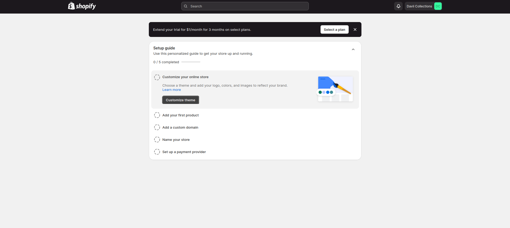

# Shopify Dashboard

This is a solution I came up with for the Frantz Kati shopify dashboard Frontend Challenge.

## Table of contents

- [Overview](#overview)
  - [The challenge](#the-challenge)
  - [Screenshot](#screenshot)
  - [Links](#links)
- [My process](#my-process)
  - [Built with](#built-with)
  - [What I learned](#what-i-learned)
- [Author](#author)

## Overview

A project primarily on implementing a Shopify merchant dashboard UI with pixel-perfect design and smooth ainteractions for all users, including those using keyboards and screen readers.

### The challenge

Users should be able to:

- Interact with the notification alert
- Access, interact and navigate the dropdown menu
- Access, interact and navigate the collapsible guide accordion
- Ensure things are not flying in with transitions (Micro-interactions)
- View the optimal layout depending on their device's screen size
- See hover and focus states for interactive elements

### Screenshot

### Links

- Solution URL: [github](https://github.com/Abdulmuizz98/shopify-dashboard)
- Live Site URL: [here](https://oraio-shopify-dashboard.netlify.app)

## My process

### Built with

- Semantic HTML5 markup
- CSS custom properties
- JavaScript
- Mobile-first workflow

### What I learned

- Building Accessible Web Pages: I gained valuable insights into the importance of accessibility in web design, ensuring that everyone, regardless of their abilities, can use and navigate the website effectively.

- Micro Interactions: I discovered the significance of micro interactions in enhancing user experience. By carefully designing subtle animations and transitions, I learned to create a more engaging and intuitive interface.

- Pixel-Perfect Implementation: I realized that the design provided in Figma is not merely a suggestion but an authoritative reference. Striving for pixel-perfection in implementation ensures consistency and professionalism in the final product.

- Scalability and Reusability: I learned the importance of building for scalability, utilizing reusable classes, and minimizing redundancy in code. By using const when repeating classes, I ensured a single point of change or refactor, leading to more efficient development and maintenance.

These key learnings have not only improved my technical skills but also enriched my understanding of user-centric design principles and best practices in web development.

## Author

- Twitter - [@AbdulmuizzHamz1](https://www.twitter.com/AbdulmuizzHamz1)
